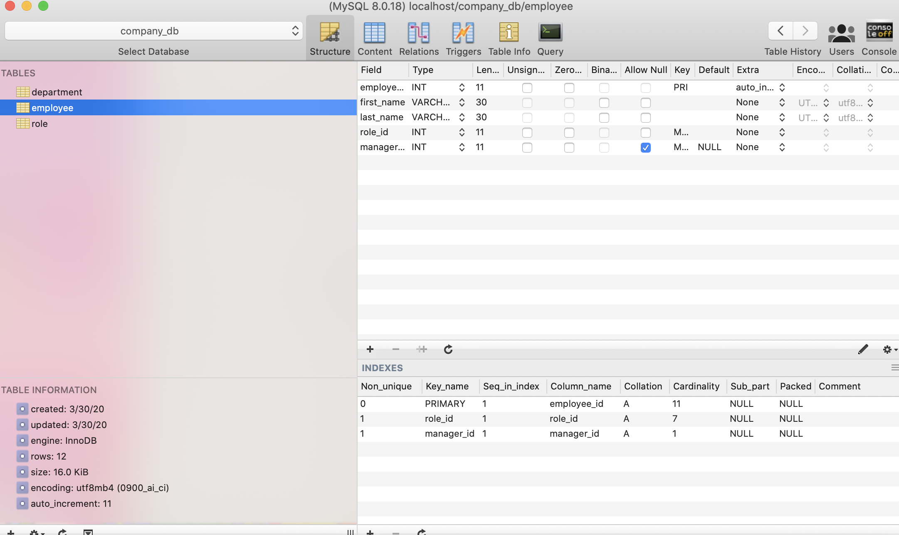

# employeetracker

This application allows you to keep track of different departments, roles, and employees using the command line and a sql database.

 ***

 

 ***
    
## Table of Contents
[Installation](#Installation)

[Usage](#Usage)
    
[Licensing](#Licensing)
    
***
    
## Installation
npm install

## Usage
After running npm install and running the server, you will be shown a menu of options in your CLI. From there you can choose to add, view, or update roles, departments, and employees.

The Database is tables for role, department, and employee linked by foreign keys.

    
## Licensing
No License
    
    
***
    
### Email: awhoerman@me.com

    